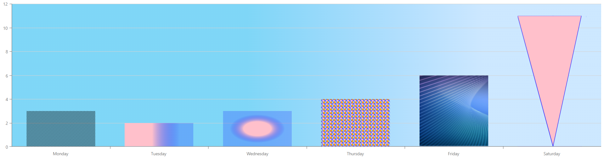

<!-- default badges list -->

<!-- default badges end -->

# Chart for DevExtreme - How to configure different SVG patterns for appearance customization

This example demonstrates how to customize the Chart appearance by configuring different SVG patterns:

You can implement this functionality in various ways. For example, add the [customizePoint](https://go.devexpress.com/DevExtreme_Documentation_dxChart_customizePoint.aspx) function and assign the pattern reference to the required point [color](https://js.devexpress.com/Documentation/ApiReference/UI_Components/dxChart/Configuration/series/point/#color).

You can also add patterns directly to the Chart color options. For example, use the [series.color](https://js.devexpress.com/Documentation/ApiReference/UI_Components/dxChart/Configuration/series/#color) property.
  
If it's necessary to add a gradient pattern as a background color, pass it to the [commonPaneSettings.backgroundColor](https://js.devexpress.com/Documentation/ApiReference/UI_Components/dxChart/Configuration/commonPaneSettings/#backgroundColor) property.
## Files to Review

- **jQuery**
    - [index.js](jQuery/src/index.js)
    - [index.html](jQuery/src/index.html)
- **Angular**
    - [app.component.html](Angular/src/app/app.component.html)
    - [app.component.ts](Angular/src/app/app.component.ts)
- **Vue**
    - [App.vue](Vue/src/App.vue)
    - [HomeContent.vue](Vue/src/components/HomeContent.vue)
- **React**
    - [App.tsx](React/src/App.tsx)
- **ASP.NET Core**    
    - [Index.cshtml](ASP.NET%20Core/Views/Home/Index.cshtml)

## Documentation

- [customizePoint()](https://js.devexpress.com/Documentation/ApiReference/UI_Components/dxChart/Configuration/#customizePoint)
- [color](https://js.devexpress.com/Documentation/ApiReference/UI_Components/dxChart/Configuration/series/point/#color)
- [backgroundColor](https://js.devexpress.com/Documentation/ApiReference/UI_Components/dxChart/Configuration/commonPaneSettings/#backgroundColor)

## Demos

- [Chart - Point Image](https://js.devexpress.com/Demos/WidgetsGallery/Demo/Charts/PointImage/jQuery/Light/)
- [Chart - Custom Legend Markers](https://js.devexpress.com/Demos/WidgetsGallery/Demo/Charts/CustomLegendMarkers/jQuery/Light/)

<!-- feedback -->
## Does this example address your development requirements/objectives?

 

(you will be redirected to DevExpress.com to submit your response)
<!-- feedback end -->
