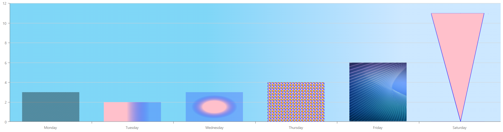

<!-- default badges list -->

<!-- default badges end -->

# Chart for DevExtreme - How to configure different svg patterns for appearance customization

This example demonstrates how to configure different svg patterns to customize the Chart appearance:

To implement this functionality, add the [customizePoint](https://js.devexpress.com/Documentation/22_1/ApiReference/UI_Components/dxChart/Configuration/#customizePoint) function and assign the pattern reference to the required point [color](https://js.devexpress.com/Documentation/22_1/ApiReference/UI_Components/dxChart/Configuration/series/point/#color).
If it's necessary to add a pattern as a background color, pass it to the [commonPaneSettings|backgroundColor](https://js.devexpress.com/Documentation/22_1/ApiReference/UI_Components/dxChart/Configuration/commonPaneSettings/#backgroundColor) property.
## Files to Look At

- **jQuery**
    - [src.js](jQuery/src/src.js)
- **Angular**
    - [app.component.html](Angular/src/app/app.component.html)
    - [app.component.ts](Angular/src/app/app.component.ts)
- **Vue**
    - [App.vue](Vue/src/App.vue)
- **React**
    - [App.js](React/src/App.js)
- **NetCore**    
    - [Index.cshtml](ASP/ASP/Pages/Index.cshtml)

## Documentation

- [customizePoint()](https://js.devexpress.com/Documentation/22_1/ApiReference/UI_Components/dxChart/Configuration/#customizePoint)
- [color](https://js.devexpress.com/Documentation/22_1/ApiReference/UI_Components/dxChart/Configuration/series/point/#color)
- [backgroundColor](https://js.devexpress.com/Documentation/22_1/ApiReference/UI_Components/dxChart/Configuration/commonPaneSettings/#backgroundColor)

## Demos

- [Chart - Point Image](https://js.devexpress.com/Demos/WidgetsGallery/Demo/Charts/PointImage/jQuery/Light/)
- [Chart - Custom Legend Markers](https://js.devexpress.com/Demos/WidgetsGallery/Demo/Charts/CustomLegendMarkers/jQuery/Light/)

